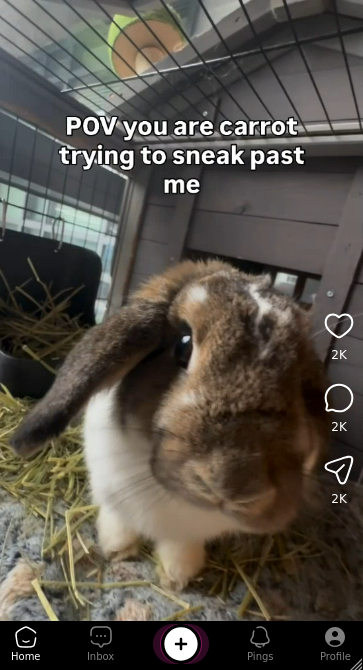

<p align="center">
  
</p>
<p align="center">Open-Source P2P Social Media To Overload Your Dopamine!</p>
<p align="center">
  <a href="#-key-features">Key Features</a> •
  <a href="#-installation">Installation</a>
</p>

# ⚠️ This Project Is Not Ready Yet!

- [x] Just start!
- [ ] Complete the UI
- [ ] Implement [Gun.js](https://github.com/amark/gun)
- [ ] Implement API client for [PeerTube](https://joinpeertube.org/)
- [ ] Convert the app to a PWA

# 💕 Key Features

* ୨ৎ Strict Content Management
  - When you upload a video we watch it first before it reaches to community
  - Every video should be about **cute pet videos**, other genres can't be shared
* ୨ৎ Easy to Sign up
  - Creating an account is optional if you'll only scroll videos
  - No email needed just write your username and password then you are in!
* ୨ৎ Socialize
  - Liked a video? Why don't you share it with others
  - Messages are sent via WebSockets over the server, they get removed once you logout
  - You can send messages to everyone if they are active



# 🎀 Installation

Here's the installation script, run `bun run dev` when you're ready!! (˶ᵔ ᵕ ᵔ˶)‹𝟹

```sh
curl -fsSL https://bun.sh/install | bash
git clone https://github.com/chwrryroll/cutetube.git
cd cutetube
bun install
```
